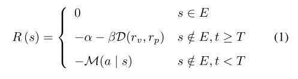
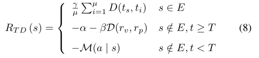

# 2022-12-08

## Feng2021[NC]如何生成NDE和NADE？

### overview

数据：Feng2021(NC)并没有提供数据和代码，只有绘制图片的数据。

动机：常规测试采用NAD(naturalistic driving environment)测试，数据需求量大，速度慢。通过生成NADE(naturalistic and adversarial driving environment)场景用于测试AV，可以解决这些问题。

核心方法：

1. 生成NDE。从行车数据中计算出车辆在每个场景、状态下的行为特征的自然分布。通过MDP建模车辆决策过程。抽样决定MDP中的决策。

2. 以NDE为基础，在此之上调整有对抗性的少数车辆的行为。采用RL方法（value network价值网络），根据AV（被测试车辆）的行为调整BV的行为。由于AV的后续行为未知，因此在学习过程中采用surrogate models，利用先验知识。由于调整的车辆数量较少，根据importance sampling理论，生成的车辆行为不会与自然分布有太大差距，符合现实场景。

### NDE

生成场景有两步，1. 生成路面 2. 生成其他车辆的驾驶行为

利用CARLA+https://github.com/eleurent/highway-env 渲染出高速公路场景。

用MDP建模NDE中每辆BV的行为，以秒为单位确定BV的行为。根据BV当前状态下行为的自然分布，随机抽样出BV在每个时刻的行为。

在不同的场景和状态下车辆有不同自然分布。场景被人为分成6个，状态定义为场景下的数据特征（例如在car following下与前一辆车的距离）。得到的分布包括加速度的分布、换道时的速度分布等。


### NADE

在重要事件改变某些关键车辆(POV, principal other vehicle)的分布。1. 找到pov  2. 决定如何修改分布。

识别pov：定义importance function。在每个时间点评估每辆BV的值。计算方式为criticality=exposure frequency * maneuver challenge. 即每个行为的发生概率*对AV的威胁度。值最大且大于阈值，则为POV。

exposure frequency为自然分布的概率，和前文一样获取。

maneuver challenge的值涉及AV和BV两者的行动和状态，采用强化学习方法计算。基于AV的已有知识或先验测试构建surrogate models（文中利用IDM 和 MOBIL models）。

针对car-following模式，通过MDP建模AV和BV的关系，state定义为速度、距离，action定义为BV的加速度。根据MDP构建决策树，学习未来发生碰撞的概率。

针对一般性场景，通过SM模型估计AV采取各种行为的概率，转化为car-following模式，计算期望值。


确定POV之后，对POV车辆的行为从加权计算maneuver challenge的importance function中抽样，其他BV的行为从自然分布中抽样。流程如下：


## AV test environments generation相关题材文章（ML算法，以GAN为主）

几种测试场景生成方法：

1. 从真实场景中过滤/启发式搜索挑战性场景（不能生成）
2. 从数据中得到分布，采样
3. 搜索挑战性场景参数（很难定义参数、目标，不够真实）
4. 基于规则插入（不够真实）
5. 学习算法生成（相关文章很少）

### 非ML相关

- `Guo2022[GEIT]` - Guo, Hongyan, et al. "Generation of a Scenario Library for Testing driver-automation Cooperation Safety under Cut-in Working Conditions." *Green Energy and Intelligent Transportation* (2022): 100004.

  - 本身方法没有生成场景，只是从自然驾驶数据中过滤得到重要场景。
  - review了几篇scenario generation相关的文章（包括）`Feng2021[NC]`。
  - 大部分这类文章称为scenario-based test，重点在于区别随机生成的场景（NDE）和危险场景（NADE），使用NADE进行测试，加快速度。

- `Karunakaran2020[NULL]` - Dhanoop Karunakaran, et al. "Efficient falsification approach for autonomous vehicle validation using a parameter optimisation technique based on Reinforcement Learning" arXiv.

  -  使用基于RL的Neural Architecture Search算法搜索具有对抗性的关键场景。其中搜索问题被转化为一个参数优化问题。场景的**重要参数**被提取出。
  -  review了用优化算法搜索对抗性场景以及用参数构建场景的文章。
  -  文章只进行了行人过马路场景的搜索，重要参数为汽车出发位置、行人速度、行人加速度、行人位置、天气。目标函数（判断是否为对抗性场景）定义为分段函数之类的。

- `Kim2019[ACM]` - Baekgyu Kim, et al. "Test Specification and Generation for Connected and Autonomous Vehicle in Virtual Environments." ACM Transactions on Cyber-Physical Systems(2019)

  - 前身工作“The SMT-based automatic road network generation in vehicle simulation environment”研究了如何formalize各种**弯道**，并自动生成道路。

  

  - 提出在给定path和behavior下生成虚拟测试场景的方法，考虑3D坐标。
  - 特点是比前身工作做的更细，考虑信号灯、车、自行车、行人等细节要素。
  - 生成路径的方法称为SMT(Satisfiability Modulo Theories)-based path generation algorithm，动态要素生成方法称为model-checking-based object run generation。生成的动态要素比较死板，没考虑驾驶员行为等因素（可以理解为根据规则插入）。没有强调生成对抗性场景。

### ML生成场景

- `Baumann2021[IEEE]` - "Automatic Generation of Critical Test Cases for the Development of Highly Automated Driving Functions." IEEE VTC2021
  - 用Q-learning生成关键场景的参数。
  - 模拟了一个超车场景，确定了三个重要参数用来计算目标函数，用于确定场景的参数有几十个，没有在文中一一列出。

- `Wen2020[HCIS] `- "A scenario generation pipeline for autonomous vehicle simulators." Human-centric Computing and Information Sciences
  - 在生成场景过程中使用CNN。
  - 基于cnn的场景agent选择器选择agent生成场景。（没懂）

- `Tan2021[CVPR]` - "SceneGen: Learning to Generate Realistic Traffic Scenes." CVPR 2021
  - 使用一种neural autoregressive model生成交通场景。
  - 需要给定AV的初始状态和道路地图。算法将车辆等插入地图，模拟人类行为。
  - 学习交通场景的分布，然后进行采样。

- `Xiang2022[NULL]`

## SUMO生成道路

SUMO文档中`.edge.xml`文件中比较重要的特征

| Attribute Name |                          Value Type                          |                         Description                          |
| :------------: | :----------------------------------------------------------: | :----------------------------------------------------------: |
|       id       |                         id (string)                          |             The id of the edge (must be unique)              |
|    **from**    |                      referenced node id                      | The name of a node within the nodes-file the edge shall start at |
|     **to**     |                      referenced node id                      | The name of a node within the nodes-file the edge shall end at |
|      type      |                      referenced type id                      | The name of a type within the [SUMO edge type file](../SUMO_edge_type_file.html) |
|  **numLanes**  |                             int                              |  The number of lanes of the edge; must be an integer value   |
|   **speed**    |                            float                             | The maximum speed allowed on the edge in m/s; must be a floating point number (see also "Using Edges' maximum Speed Definitions in km/h") |
|    priority    |                             int                              | The priority of the edge. Used for [#Right-of-way](#right-of-way)-computation |
|   **length**   |                            float                             |               The length of the edge in meter                |
|     shape      | List of positions; each position is encoded in x,y or x,y,z in meters (do not separate the numbers with a space!). | If the shape is given it should start and end with the positions of the from-node and to-node. Alternatively it can also start and end with the position where the edge leaves or enters the junction shape. This gives some control over the final junction shape. When using the option **--plain.extend-edge-shape** it is sufficient to supply inner geometry points and extend the shape with the starting and ending node positions automatically |
|   spreadType   |           enum ( "right", "center", "roadCenter")            | The description of how to compute lane geometry from edge geometry. See [SpreadType](#spreadtype) |
|     allow      |                   list of vehicle classes                    | List of permitted vehicle classes (see [access permissions](#road_access_permissions_allow_disallow)) |
|    disallow    |                   list of vehicle classes                    | List of forbidden vehicle classes (see [access permissions](#road_access_permissions_allow_disallow)) |
|   **width**    |                            float                             | lane width for all lanes of this edge in meters (used for visualization) |
|      name      |                            string                            |   street name (need not be unique, used for visualization)   |
|   endOffset    |                          float >= 0                          | Move the stop line back from the intersection by the given amount (effectively shortening the edge and locally enlarging the intersection) |
| sidewalkWidth  |                          float >= 0                          | Adds a sidewalk with the given width (defaults to -1 which adds nothing). |
| bikeLaneWidth  |                          float >= 0                          | Adds a bicycle lane with the given width (defaults to -1 which adds nothing). |
|    distance    |                            float                             | [Kilometrage](../Simulation/Railways.html#kilometrage_mileage_chainage) at the start of this edge. If the value is positive, kilometrage increases in driving direction; if the value is negative, kilometrage decreases. Kilometrage along the edge is computed as abs(*distance* + *offsetFromStart*). |

python代码生成`.node.xml`和`.edge.xml`文件

```
# 生成Node文件, 从左下角(0,0)开始生成的
nodes_num = 6
with open('example.nod.xml', 'w') as file:
    file.write('<nodes> \n\n')
    for i in range(nodes_num):
        for j in range(nodes_num):
            file.write('\t<node id="node%d" x="%d" y="%d" type="priority" /> \n' % (i * 6 + j, i * 100, j * 100))
    file.write('\n</nodes>')

# 生成edge文件
with open('example.edg.xml', 'w') as file:
    file.write('<edges> \n\n')
    for i in range(nodes_num):
        for j in range(nodes_num):
            k = 0
            if i > 0:
                file.write(
                    '\t<edge id="edge%d_%d" from="node%d" to="node%d" priority="75" numLanes="2" speed="40" /> \n' % (
                        i * 6 + j, k, i * 6 + j, (i - 1) * 6 + j))
                k = k + 1
            if i < 5:
                file.write(
                    '\t<edge id="edge%d_%d" from="node%d" to="node%d" priority="75" numLanes="2" speed="40" /> \n' % (
                        i * 6 + j, k, i * 6 + j, (i + 1) * 6 + j))
                k = k + 1
            if j > 0:
                file.write(
                    '\t<edge id="edge%d_%d" from="node%d" to="node%d" priority="75" numLanes="2" speed="40" /> \n' % (
                        i * 6 + j, k, i * 6 + j, i * 6 + j - 1))
                k = k + 1
            if j < 5:
                file.write(
                    '\t<edge id="edge%d_%d" from="node%d" to="node%d" priority="75" numLanes="2" speed="40" /> \n' % (
                        i * 6 + j, k, i * 6 + j, i * 6 + j + 1))
                k = k + 1
    file.write('\n</edges>')
```

之后在cmd运行 `netconvert` 命令生成 `network` 文件.

```
netconvert --node-files=example.nod.xml --edge-files=example.edg.xml --output-file=example.net.xml
```

# 2023-01-03

## Tan2021[CVPR]

网络设计中使用的参数：

对每一个actor $a_i$，用向量描述 1. 属性标签$(c_i)$，表示是汽车、行人还是自行车，2. 位置$(x_i, y_i)$，3. 所在的矩形位置（box），包括长宽和角度$(w_i, l_i, \theta_i)$，行人为圆点，4. 速度$(v_i)$

将所有BV的分布定义为序贯的条件分布乘积，用ConvLSTM学习这种序贯模型

## 其他文章

- `Tan2021[CVPR]` 

生成场景

- `Suo2021[CVPR]` - "TrafficSim: Learning to Simulate Realistic Multi-Agent Behaviors"

在给定场景下确定车辆行为

“Given a HD map M, traffic control C, and initial dynamic states of N traffic actors, our goal is to simulate their motion forward.”

- `Wang2021[CVPR]` - "AdvSim: Generating Safety-Critical Scenarios for Self-Driving Vehicles"

寻找对抗性场景

- `Zeng2020[ECCV]` - "DSDNet: Deep Structured Self-driving Network"

在SDV的视角预测其他车辆的行为，输出可行轨道

# 2022-01-24

## Review

1. `Koren2019[arXiv]`----Adaptive Stress Testing for Autonomous Vehicles

主要内容：使用AST找到最容易发生碰撞的场景。只考虑行人过马路时一辆车的场景。

AST: 用于寻找使一种自动驾驶策略SUT发生失败的场景。将环境动作建模为MDP，可使用DRL搜索。


AST的运行：如Fig.1，开始时solver输入初始环境状态（即BV状态）给simulator，simulator加入噪音、过滤之后输入给SUT，SUT选择行为后将状态转移概率给reward function，reward计算出每个环境action的reward，solver根据reward分别使用MCTS或DRL得到action。不断迭代推进MDP，直到发生碰撞。输出该过程中的actions，表示发生危险的事件。

文中仅针对行人过马路场景设置函数细节。state参数为速度、位置，action参数为加速度、速度、位置。


评价：1. 没有静态初始化，为动态问题，考虑了环境和AV的交互；2. 研究的场景很简单，没有车辆间交互，所以reward比较简单（参考`Feng2019[NC]`中对车辆间交互的reward设计）；3. 加入noisy、filter的思想可以采用；4. 所谓的AST框架是在MDP下环境和车辆按顺序决策

2. `Corso2019[ITSC]`----Adaptive Stress Testing with Reward Augmentation for Autonomous V ehicle Validation

`Koren2019[arXiv]`的延伸。

主要内容：在`Koren2019[arXiv]`的基础上，为了避免重复搜索/不可避免的场景，修改reward function（加入安全策略RSS和相似度指标）。

RSS：使用行人过马路为例子。主要通过车辆和行人的加速度、速度、位置计算出何时需要进行什么反应以避免碰撞，称为适当行为。

目标函数：(1)为原reward，(6)为考虑RSS的reward，将关键状态集$E$(碰撞)修改为一定比例驾驶行为不适当的状态集合，目标中的距离修改为不正确的比例。(8)为考虑相似度的reward，在终止时加入与之前已发现状态的相似成本，$a$与$b$的相似度定义为将二者路径归一化之后的欧拉距离均值。






评价：RSS设计存疑，因为我们更希望找到failure发生的场景。

3. `Feng2020[IEEE]`----Testing Scenario Library Generation for Connected and Automated V ehicles: An Adaptive Framework

`Feng2019[NC]`的前作，还有part 1 Methodology和part 2 Case studies。

主要内容：在offline生成的场景的基础上通过实车测试得到质量更高的场景库，场景库根据实车自动驾驶模型定制，使用贝叶斯优化解决场景overweight或underweight的问题。

前文主要内容：

1. 通过importance sampling理论，得到给定置信度下采样次数（与方差成正比），方差与importance function相关，引入scenario criticality定义function。scenario criticality=exposure frequency*maneuver challenge. 
2. 通过SM模型估计maneuver challenge，但是SM与CAV自身性能有差别，导致上述overweight或underweight问题。

框架：以offline结果为输入，用实车测试更新SM模型和场景库。


问题：目标是减小SM与CAV的估计差异，每次实车测试能得到一个真实值。应该尽量用少的观察值得到结果，减少实车测试。贝叶斯优化可用于此。

评价：与实车测试结合的方法可以考虑。

4. `Behzadan2019[IEEE]`----Adversarial Reinforcement Learning Framework for Benchmarking Collision Avoidance Mechanisms in Autonomous Vehicles

主要内容：利用DRL框架训练BV，使其尽量与AV产生碰撞，用于测试AV的避撞机制。重点训练BV运动中的行为。

目标函数：将BV的行为设置为action。目标是尽量让AV发生碰撞。碰撞分为三种情况，分别设定目标值：(a)直接碰撞（目标函数为$产生碰撞的成本+两车距离$），(b)诱导碰撞（目标函数为$BV产生碰撞的成本+AV产生碰撞的成本+两车距离$），(c)变换轨迹（目标函数为$AV转换轨道的距离+两车距离$）。在文中各个成本似乎是参数。

DRL模型：deep Q-learning等针对离散情况的模型处理连续的驾驶行为不合适；文中未明确指定。

评价：因为是magazine，写的比较模糊。1. 与AST两篇文章思想一样，但是考虑车辆与车辆的场景；2. 三种碰撞机制尤其是诱导碰撞比较有趣，其他文章如`Feng2019[NC]`中没有体现。


# 2022-02-07

## 代码学习

学习Keras写GAN，未来尝试复现henry的文章

尝试用keras写简单的神经网络，看简单的GAN

因为henry文章中有DRL解MDP，所以补了一下DRL相关知识

# 2022-02-14

## 把SUMO road的参数输入网络

暂时没考虑匝道，所以重要参数只有速度上限和车道数量。

```
def train(self, epochs):
    for epoch in range(epochs):
    	speed, lane_num = get_road_data()
	return 1

def get_road_data(self):
	speed = random.randint(70, 80)
	lane_num = random.randint(1, 4)
	return speed, lane_num
```

简单写了网络框架：

```
# -*- coding: utf-8 -*-
"""
Created on Fri Feb 17 2023
@author: Ke, Hang
"""

import keras
import numpy as np
import matplotlib.pyplot as plt
from keras import layers, models


class GAN():
    def __init__(self):
        self.road_dim = 2
        self.traj_dim = 10
        self.task_dim = 10
        self.scen_dim = 100

        self.discriminator = self.build_discriminator()
        self.discriminator.compile(optimizer='adam', loss='mse')

        self.generator = self.build_generator()

        gan_input = layers.Input(shape=(self.road_dim, self.traj_dim, self.task_dim))
        scenario = self.generator(gan_input)
        validity = self.discriminator(scenario)
        self.combined = models.Model(gan_input, validity)
        self.combined.compile(loss='binary_crossentropy', optimizer='adam')

    def build_generator(self):
        model = models.Sequential()
        model.add(layers.Dense(100, input_dim=self.road_dim + self.traj_dim + self.task_dim))
        # todo
        road = layers.Input(shape=(self.road_dim,))
        trajectory = layers.Input(shape=(self.traj_dim,))
        AV_task = layers.Input(shape=(self.task_dim,))
        scenario = model([road, trajectory, AV_task]) # todo 处理多输入

        return models.Model([road, trajectory, AV_task], scenario)

    def build_discriminator(self):
        validity = 1
        # todo
        scenario = layers.Input(shape=self.scen_dim)
        return models.Model(scenario, validity)

    def train(self, epochs):
        for epoch in range(epochs):
            speed, lane_num = get_road_data()
        return 1

    def get_road_data(self):
        speed = random.randint(70, 80)
        lane_num = random.randint(1, 4)
        return speed, lane_num

```


## 把road画出来

先用python生成给定参数的edge, node文件，再由netcover生成net文件，用sumo打开得到路径图。

文件生成代码：

```
import random

nodes_num = 2
road_length = 1000
speed = random.randint(70, 80)
lane_num = random.randint(1, 4)

# 生成Node文件, 从(0,0)开始生成的
with open('example.nod.xml', 'w') as file:
    file.write('<nodes> \n\n')
    file.write('\t<node id="node%d" x="%d" y="%d" type="priority" /> \n' % (0, 0, 0))
    file.write('\t<node id="node%d" x="%d" y="%d" type="priority" /> \n' % (1, 0 + road_length, 0))
    file.write('\n</nodes>')

# 生成edge文件
with open('example.edg.xml', 'w') as file:
    file.write('<edges> \n\n')
    file.write(
        '\t<edge id="edge%d" from="node%d" to="node%d" priority="75" numLanes="%d" speed="%d"/> \n'
        % (0, 0, 1, 5, speed))
    file.write('\n</edges>')

# 生成route文件
with open('example.rou.xml', 'w') as file:
    file.write('<routes> \n\n')
    # 第一种车型：普通BV
    file.write(
        '\t<vType id="type%d" accel="%.1f" decel="%.1f" sigma="%.1f" length="%d" color="1,0,0"/>\n'
        % (0, 0.8, 4.5, 0.5, 5))
    # 第二种车型：pov
    file.write(
        '\t<vType id="type%d" accel="%.1f" decel="%.1f" sigma="%.1f" length="%d" color="0,1,0"/>\n\n'
        % (1, 0.8, 4.5, 0.5, 5))
    # 路径
    file.write('\t<route id="route0" edges="edge0"/>\n\n')
    # 车辆
    file.write(
        '\t<vehicle id="%d" type="type%d" route="route0" depart="0" departLane="%d" departPos="%d"/>\n'
        % (0, 0, 0, 100))
    file.write(
        '\t<vehicle id="%d" type="type%d" route="route0" depart="0" departLane="%d" departPos="%d"/>\n'
        % (2, 1, 1, 50))
    file.write('\n</routes>')
```

路径图展示（5车道）：


## GAN框架输入trajectory是否合理？


## 碰撞场景案例

https://youtube.com/shorts/vpvDH-WLB9Q?feature=share

# 2022-02-22

1. 阅读ACC模型和IDM模型（简单读了car-following和MOBIL）
2. 阅读car-following simulation的python代码（简单读了另一个IDM+MOBIL的仿真代码）

这些仿真代码里没有处理车辆碰撞场景，我们的项目中需要处理

# 2022-02-28

## 修改GAN框架图


## 编写仿真代码，尝试运行


完成problem 1。problem 2的predictive planning method还没了解。对ACC模型的参数$t_{hw}$有点疑问。模拟代码：

````
""" 模拟一辆车前进，另一辆车使用ACC模型跟进的情况
    在模拟中两辆车一起前进，遇到碰撞事件直接退出程序
    """
import sys

k1 = 0.23  # parameters
k2 = 0.07
thw = 0.0
v1_ini = 20  # initial speed
v2_ini = 20
h_ini = 40  # Initial Headway
T = 30  # Total Simulation Time
Tstep = 0.1  # Time step for Simulation

v1_2 = 0  # 行驶状态参数
v1_3 = 20
a1_ac = 4
a1_de = -4
t1 = 10
t2 = 15
t3 = 21

t = []  # Time of Traveling
for i in range(0, int(T / Tstep)):
    t.append(i * 0.1)

# Initialization of Deceleration Matrix, Speed Matrix, Movement Matrix
a = [[], []]
v = [[], []]
d = [[], []]


# 第二辆车按ACC前进
def v2_go(step):
    v[1].append(v[1][step - 1] + a[1][step - 1] * 0.1)
    d[1].append(d[1][step - 1] + (v[1][step - 1] + v[1][step]) / 2 * Tstep)
    a[1].append(k1 * (d[0][step] - d[1][step] - thw * v[1][step]) + k2 * (v[0][step] - v[1][step]))


# 检测是否发生碰撞，若发生则
def crash_test(step):
    if (d[0][step] <= d[1][step]):
        print("crash at time step: %.2f" % (step / 10))
        output_data(step)
        sys.exit(0)


# Output to File for Plotting
def output_data(step=int(T / Tstep)):
    f = open('CarFollowing.txt', 'w')
    for i in range(0, step):
        f.write('time %.1f:\t' % t[i])
        f.write('car 0: %.2f\t%.2f\t%.2f\t' % (d[0][i], v[0][i], a[0][i]))
        f.write('car 1: %.2f\t%.2f\t%.2f\t' % (d[1][i], v[1][i], a[1][i]))
        f.write('\n')
    f.close()


v[0].append(v1_ini)
d[0].append(h_ini)
a[0].append(0)
v[1].append(v2_ini)
d[1].append(0)
a[1].append(0)
# 不变速10秒
for i in range(1, int(t1 / Tstep)):
    v[0].append(v1_ini)
    d[0].append(d[0][i - 1] + (v[0][i - 1] + v[0][i]) / 2 * Tstep)
    a[0].append(0)
    v2_go(i)
    crash_test(i)
# 用a1_de减速到v1_2
for i in range(int(t1 / Tstep), int(t2 / Tstep)):
    v[0].append(v[0][i - 1] + a[0][i - 1] * Tstep)
    d[0].append(d[0][i - 1] + (v[0][i - 1] + v[0][i]) / 2 * Tstep)
    a[0].append(a1_de)
    v2_go(i)
    crash_test(i)
# 用a1_ac加速到v1_3
for i in range(int(t2 / Tstep), int(t3 / Tstep)):
    v[0].append(v[0][i - 1] + a[0][i - 1] * Tstep)
    d[0].append(d[0][i - 1] + (v[0][i - 1] + v[0][i]) / 2 * Tstep)
    a[0].append(a1_ac)
    v2_go(i)
    crash_test(i)
# 不变速10秒
for i in range(int(t3 / Tstep), int(T / Tstep)):
    v[0].append(v[0][i - 1])
    d[0].append(d[0][i - 1] + (v[0][i - 1] + v[0][i]) / 2 * Tstep)
    a[0].append(0)
    v2_go(i)
    crash_test(i)

output_data()
````

剩余时间继续学习神经网络/traffic flow。

# 2022-03-11

## re-write the framework of the algorithm


# 2023-03-23

## use TTC to test collision

time-to-collision


if $TTC_i \leq fixed-value$, vehicle $i$ is colliding with vehicle $i-1$.

## use data in OpenACC

1. download trajectory data in OpenACC

| Data Set      | Number of Vehicle(traj) | ACC&manually driving |
| ------------- | ----------------------- | -------------------- |
| AstaZero      | 2-3                     | ACC/manually driving |
| Casale        | 2-3                     | ACC                  |
| **Cherasco**  | 2-3                     | mixed                |
| **Vicolungo** | 5                       | ACC/manual/mixed     |
| ZalaZone      | 10                      | ACC                  |

- Cher-JRC_240918_rec1_part1_highway		4e4	3
- JRC-Cher_3008_rec2_part2			2e4	2
- JRC-Cher_240918_rec1_part2_highway		3e4	2
- JRC-Cher_240918_rec2_highway		2e4	2

- JRC-VC_260219_part4_highway		5e3	5
- VC-JRC_280219_part2			6e3	5
- VC-JRC_280219_part3			7e3	5

2. Use manual trajectory as leading vehicle's trajectory. 

3. compare the leading vehicle with the following vehicle/our acc vehicle with AV in the data set

Results show that, at first acc will have a high deceleration, because the distance between the leading vehicle and av is small (30m). After the distance enlarged to 100m, delta-v will be close to 0.